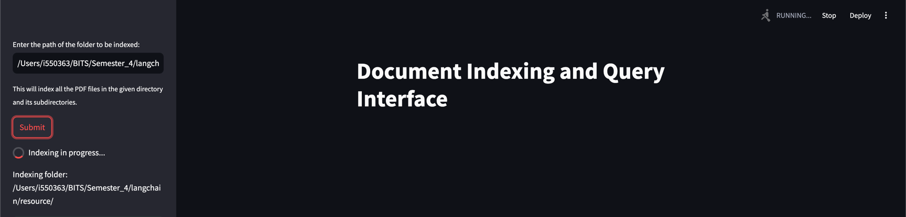
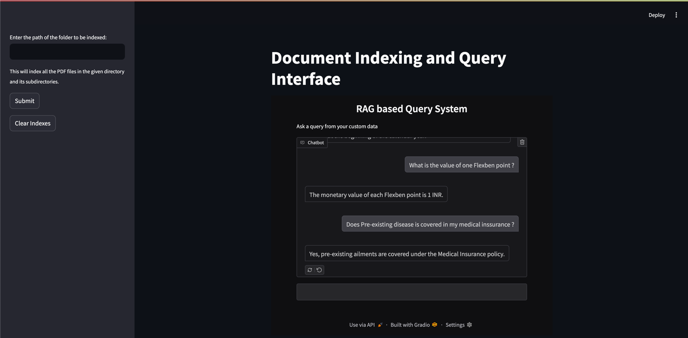

Here is a `readme.md` file for your project:

# Document Indexing and Query Interface

This project provides a Streamlit-based interface for indexing documents and querying them using a Gradio chat interface. The project uses LangChain and Ollama LLM for processing queries.

## Features

- **Document Indexing**: Index PDF files in a specified directory and its subdirectories.
- **Query Interface**: Ask queries based on indexed documents.
- **Clear Indexes**: Clear all indexed documents.
- **Busy Indicator**: Shows a spinner while indexing or clearing indexes.
- **Auto-disappearing Messages**: Success messages disappear automatically after 5 seconds.

## Requirements

- Python 3.7+
- `streamlit`
- `gradio`
- `langchain`
- `langchain_ollama`
- `PyMuPDF`
- `sentence-transformers`
- `python-dotenv`
- `hdbcli`
- `numpy`
- `tiktoken`

## Installation

1. Clone the repository:
    ```sh
    git clone <repository-url>
    cd <repository-directory>
    ```

2. Install the required packages:
    ```sh
    pip install -r requirements.txt
    ```

3. Create a `.env` file in the root directory and add the following environment variables:
    ```env
    HANA_ADDRESS=<HANA-ADDRESS>
    HANA_PORT=<HANA-PORT>
    HANA_USER=<HANA-USER>
    HANA_PASSWORD=<HANA-PASSWORD>
    TABLE_NAME=<TABLE-NAME>
    GRADIO_APP_HOST=http://localhost
    GRADIO_APP_PORT=7860
    ```

## Usage

1. **Run the Streamlit app**:
    ```sh
    python gradio_app.py  # Run the Gradio chat interface
    streamlit run streamlit_app.py # Run the Streamlit app
    ```

2. **Index Documents**:
    - Enter the path of the folder containing PDF files in the sidebar.
    - Click the "Submit" button to start indexing.

3. **Clear Indexes**:
    - Click the "Clear Indexes" button to clear all indexed documents.

4. **Query Interface**:
    - Once documents are indexed, the Gradio chat interface will be available for querying.

## File Structure

- `gradio_app.py`: Contains the Gradio chat interface configuration.
- `requirements.txt`: Lists all the dependencies required for the project.
- `streamlit_app.py`: Contains the Streamlit app configuration.
- `llm/llm_action.py`: Contains the logic for handling queries using LangChain and Ollama LLM.
- `dataoperation/hdbclinet.py`: Contains functions for checking and clearing document indexes.
- `embeddings/generate_embeddings.py`: Contains functions for generating embeddings for documents.
- `chunks/chunks.py`: Contains functions for splitting documents into chunks.
- `pages/parse_pdf.py`: Contains the Streamlit page for indexing documents.

## Screenshots
Indexing Documents:


Query Interface:



## Authors

- Manglam Kumar (manglamsingh10@gmail.com)